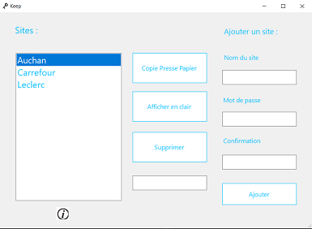

# Keep

## What is Keep ?

Keep is an educational project made to learn C# / .Net Framework.

Keep allow the user to encrypt and store password in a .csv file. 

The first form is a login one, you can create a profile or select an existing one and enter an encryption key. You will be redirected to the MainForm without the key beeing checked.

On the main form, you can add a new site with a password, remove one or see a site password. You can either copy the password to your clipboard or print it in the textbox. If the key entered in the login form is wrong, you will either be given a wrong password or have an error. For each site, you can check when have you registered the password and how many time this password is use througout your profile.

## How was it done ?

This project is largely inspired by [Tim Corey's tutorial](https://www.youtube.com/watch?v=wfWxdh-_k_4&t=76769s&ab_channel=freeCodeCamp.org).

Although I implemented an AES encryption, the IV is public and the system is not secure at all. I advise against using Keep to store important password.

Here is an example of how passwords are stored in a CSV file.

